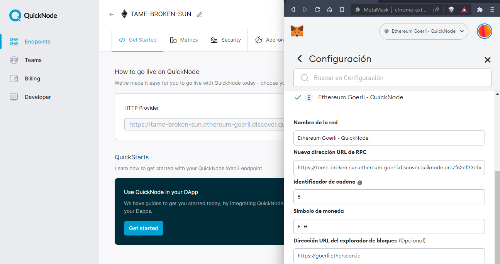

# Metaschool - First Smart Contract

In this [course](https://metaschool.so/courses/writing-your-first-hello-world-contract-in-solidity) I have learned how to set up my [MetaMask](https://metamask.io/), setting up [Alchemy App](https://www.alchemy.com/), deploying to Goerli testnet and interacting with my contract.

## Quick Node endpoint

First, we are going to create an endpoint in [QuickNode](https://www.quicknode.com/). Then add the network to [MetaMask](https://metamask.io/)



Let's get some **ETH** in this [faucet](https://goerlifaucet.com/).

## Create the project

Now we have to create a new project.

```bash
$ npm init --yes
Wrote to Metaschool - First Smart Contract/package.json:

{
  "name": "metaschool---first-smart-contract",
  "version": "1.0.0",
  "description": "",
  "main": "index.js",
  "scripts": {
    "test": "echo \"Error: no test specified\" && exit 1"
  },
  "keywords": [],
  "author": "",
  "license": "ISC"
}
```

### HardHat

Then, we need to install [HardHat](https://hardhat.org/).

```js
$ npm install --save-dev hardhat

added 300 packages, and audited 301 packages in 55s

61 packages are looking for funding
  run `npm fund` for details

found 0 vulnerabilities
npm notice
npm notice New major version of npm available! 8.19.2 -> 9.2.0
npm notice Changelog: https://github.com/npm/cli/releases/tag/v9.2.0
npm notice Run npm install -g npm@9.2.0 to update!
npm notice

$ npx hardhat
888    888                      888 888               888
888    888                      888 888               888
888    888                      888 888               888
8888888888  8888b.  888d888 .d88888 88888b.   8888b.  888888
888    888     "88b 888P"  d88" 888 888 "88b     "88b 888
888    888 .d888888 888    888  888 888  888 .d888888 888
888    888 888  888 888    Y88b 888 888  888 888  888 Y88b.
888    888 "Y888888 888     "Y88888 888  888 "Y888888  "Y888

Welcome to Hardhat v2.12.5

✔ What do you want to do? · Create an empty hardhat.config.js
Config file created

Give Hardhat a star on Github if you're enjoying it!

     https://github.com/NomicFoundation/hardhat

Please take a moment to complete the 2022 Solidity Survey: https://hardhat.org/solidity-survey-2022
```

### Other dependencias

Install other dependencias to not made the **private key** visible and to get access to `ethers.js` library.

```js
$ npm install dotenv --save

added 1 package, and audited 302 packages in 1s

61 packages are looking for funding
  run `npm fund` for details

found 0 vulnerabilities

$ npm install --save-dev @nomiclabs/hardhat-ethers

added 17 packages, and audited 319 packages in 17s

74 packages are looking for funding
  run `npm fund` for details

found 0 vulnerabilities
```

## Deploy

Running this command, our contract will be deployed. We will be able to see the address of the contract. [Etherscan](https://goerli.etherscan.io/address/0x38cbf0a64e4df80a9d66cacda88abe9ed325861b)

```js
$ npx hardhat run scripts/deploy.js --network goerli
✔ Help us improve Hardhat with anonymous crash reports & basic usage data? (Y/n) · n
Compiled 1 Solidity file successfully
Contract Deployed to: 0x38CBF0A64E4Df80A9D66caCDa88ABE9Ed325861b
```

## Interact

Finally, we will run this command to interact with our **Smart Contract**. The main function calls the messafe function again to get the updated message, and then it logs the new message to the console.

```js
$ npx hardhat run scripts/interact.js
the message is Hello World! Bingo
the new message is Good Bye, World!
```