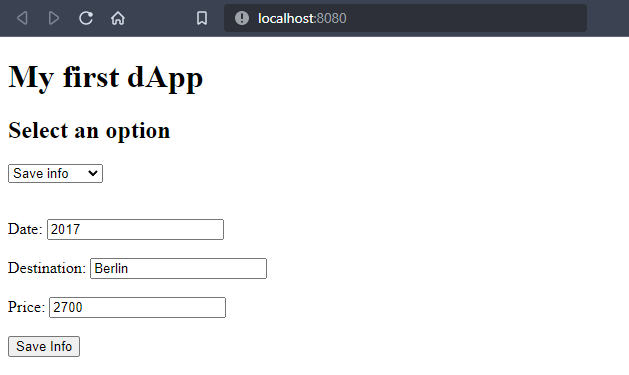
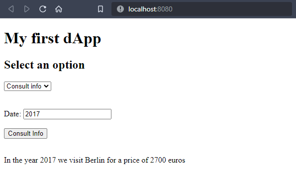

# OpenWebinars - First dApp

In this [course](https://openwebinars.net/academia/portada/mi-primera-dapp/) I have learned how to create a very basic **Decentralized Application** using [Truffle](https://trufflesuite.com/). The purpose of this website is to record trips by date in our local blockchain network.

## Truffle

First, we have to install [Truffle](https://trufflesuite.com/) using [npm](https://www.npmjs.com/).

```js
$ npm install -g truffle
```

Then, create a new project using [boxes](https://trufflesuite.com/boxes/).

```js
$ truffle unbox webpack
This directory is non-empty...
? Proceed anyway? (Y/n)
Starting unbox...
=================

? Proceed anyway? Yes
✓ Preparing to download box
✓ Downloading
✓ Cleaning up temporary files
✓ Setting up box

Unbox successful, sweet!

Commands:

  Compile:              truffle compile
  Migrate:              truffle migrate
  Test contracts:       truffle test
  Run dev server:       cd app && npm run dev
  Build for production: cd app && npm run build

```

Now, start the local network.

```js
$ truffle develop

Truffle Develop started at http://127.0.0.1:8545/

Accounts:
(0) 0xef3d32f8de9ae60152afef918387e3ac77255554
(1) 0x1f3b7fd5f7c365284e3b6afbc744dafa3638c3df
(2) 0x398b002e885764f75ff688e3adfcdecf85dbdb9e
(3) 0x7a1e1ef817632ac10a16169e9b5950f5cb7cede8
(4) 0x2c162d2c3a57df71251ede0d36b474e8c0c03115
(5) 0xccdd4d1a0346354974a79beeac4368c824ef3172
(6) 0xf25576ff1749b5fdd94e7d8f2150d5a0da61aec9
(7) 0x86d6efcb48f908676f473f0812328c443d3d37b3
(8) 0x213550ed588df2e5587f2aa4e8c6cce4f314bc7e
(9) 0x0fe75be40140ee3f2701f622488787768e9c0451

Private Keys:
(0) 
(1) 
(2) 
(3) 
(4) 
(5) 
(6) 
(7) 
(8) 
(9) 

Mnemonic: explain hood bounce drill brown enroll evidence bus arch treat marine enact

⚠️  Important ⚠️  : This mnemonic was created for you by Truffle. It is not secure.
Ensure you do not use it on production blockchains, or else you risk losing funds.
```

Then, **compile** the smart contracts.

```js
truffle(develop)> compile

Compiling your contracts...
===========================
> Everything is up to date, there is nothing to compile.
```

Let's test our smart contract.

```js
truffle(develop)> test
Using network 'develop'.


Compiling your contracts...
===========================
> Everything is up to date, there is nothing to compile.


  Contract: Mi first smart contract
    ✔ First test - Correct destination value (329ms)
    ✔ Second Test - Correct price (291ms)


  2 passing (708ms)
```

Finally, migrate the smart contract to our local network.

```js
truffle(develop)> migrate

Compiling your contracts...
===========================
> Everything is up to date, there is nothing to compile.


Starting migrations...
======================
> Network name:    'develop'
> Network id:      5777
> Block gas limit: 6721975 (0x6691b7)


1_initial_migration.js
======================

   Deploying 'Migrations'
   ----------------------
   > transaction hash:    0x2e7ac6893e7339f2117b40325dee7d2e5af040b2273ea80e5f4aa3d022d54d42
   > Blocks: 0            Seconds: 0
   > contract address:    0xB573eCbb0250b98ED3E3A73183112A10B67116EE
   > block number:        10
   > block timestamp:     1671561233
   > account:             0xeF3d32f8DE9Ae60152aFeF918387e3Ac77255554
   > balance:             99.995643175726427603
   > gas used:            165475 (0x28663)
   > gas price:           2.777734045 gwei
   > value sent:          0 ETH
   > total cost:          0.000459645541096375 ETH

   > Saving migration to chain.
   > Saving artifacts
   -------------------------------------
   > Total cost:     0.000459645541096375 ETH


2_deploy_contracts.js
=====================

   Deploying 'myContract'
   ----------------------
   > transaction hash:    0xcbd2b563c0b67f86ea7bf05e41b41d7c5f686b71e1c9f3a029fd8193faaab99f
   > Blocks: 0            Seconds: 0
   > contract address:    0x6bF06f4032CF81352ceE954dD88d687a75Cc6756
   > block number:        12
   > block timestamp:     1671561234
   > account:             0xeF3d32f8DE9Ae60152aFeF918387e3Ac77255554
   > balance:             99.994807790118273679
   > gas used:            261494 (0x3fd76)
   > gas price:           2.714552042 gwei
   > value sent:          0 ETH
   > total cost:          0.000709839071670748 ETH

   > Saving migration to chain.
   > Saving artifacts
   -------------------------------------
   > Total cost:     0.000709839071670748 ETH

Summary
=======
> Total deployments:   2
> Final cost:          0.001169484612767123 ETH
```

## Webpack

Start a local web server.

```js
// Use an old version of node
$ nvm use 16.13.0
Now using Node v16.13.0 (npm 8.1.0) ~/.local/share/nvm/v16.13.0/bin/node

// Start local server
$ npm run dev

> app@1.0.0 dev
> webpack-dev-server

ℹ ｢wds｣: Project is running at http://localhost:8080/
ℹ ｢wds｣: webpack output is served from /
```

## Final result

This is the final result of the web. First, we have to record some info in the blockchain.



Then, we can search info by date.

