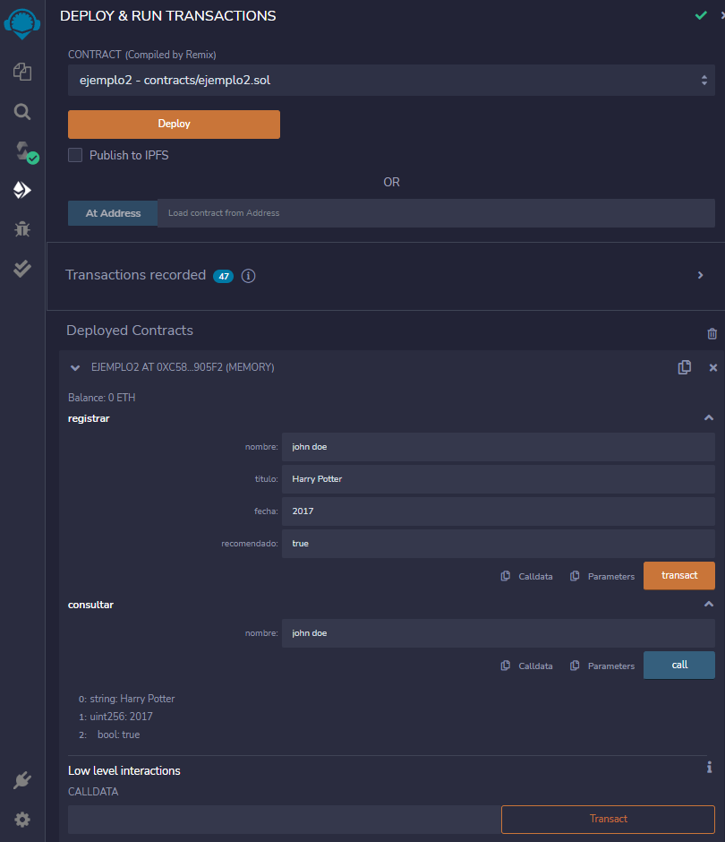

# OpenWebinars - Smart Contracts & Solidity

In this [course](https://openwebinars.net/academia/portada/smart-contracts-solidity/) I have learned about [Solidity](https://soliditylang.org/) and how to use it in Smart Contracts using [Remix IDE](https://remix.ethereum.org/).

## Ejemplo 1

In this first example we have to declare the values to deploy it. Then we can change them and consult the value they have. Finally, we can do the sum of two values.

## Ejemplo 2

In this example, we can record data about a person's favorite movie. And then look up this data through his or her name.

## Ejemplo 3

In this case we can register one trip per year. We note that the data has been saved.

We now try to add another trip in the same year.

It does not allow us to do so, and we can see the error log in the console.

## Ejemplo 4

Now we are going to transfer 10 Ethers from the selected account to the address we specify. Then we can check the balance of the destination address.

## Ejemplo 5

Finally, we will transfer 40 Ethers from the selected account to our smart contract. Then we can see the balance of our smart contract.

In the console we can see the details of the transaction and the custom log we have created, where we can see the information of the sending address.

