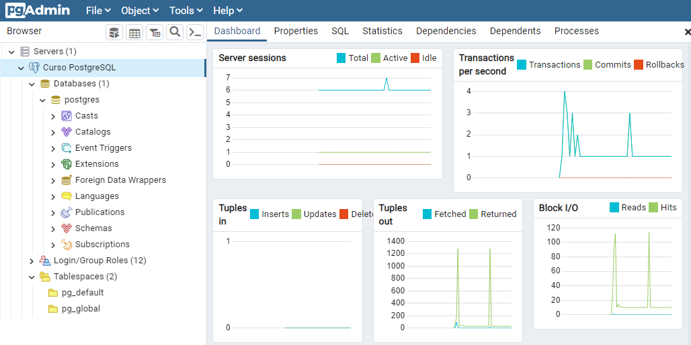

# OpenWebinars - PostgreSQL

In this [course](https://openwebinars.net/academia/portada/postgresql/) I have learned about [PostgreSQL](https://www.postgresql.org/)

## Install

First I have created an [Ubuntu 20.04](https://ubuntu.com/) virtual machine and connected via **SSH**.

```bash
❯ ssh raul@192.168.1.111
raul@192.168.1.111's password:
Welcome to Ubuntu 22.04.1 LTS (GNU/Linux 5.15.0-52-generic x86_64)

 * Documentation:  https://help.ubuntu.com
 * Management:     https://landscape.canonical.com
 * Support:        https://ubuntu.com/advantage

  System information as of sáb 10 dic 2022 12:39:13 UTC

  System load:  0.0107421875       Processes:              219
  Usage of /:   40.5% of 18.53GB   Users logged in:        1
  Memory usage: 15%                IPv4 address for ens33: 192.168.1.111
  Swap usage:   0%


0 updates can be applied immediately.
```

Then, I have installed `postgresql`.

```bash
raul@server:~$ sudo apt install postgresql
[sudo] password for raul:
Leyendo lista de paquetes... Hecho
Creando árbol de dependencias... Hecho
Leyendo la información de estado... Hecho
postgresql ya está en su versión más reciente (14+238).
Utilice «sudo apt autoremove» para eliminarlos.
0 actualizados, 0 nuevos se instalarán, 0 para eliminar y 0 no actualizados.
```

Now we can see the **status** of the service.

```bash
raul@server:~$ sudo systemctl status postgresql
● postgresql.service - PostgreSQL RDBMS
     Loaded: loaded (/lib/systemd/system/postgresql.service; enabled; vendor preset: enabled)
     Active: active (exited) since Sat 2022-12-10 12:34:56 UTC; 4min 40s ago
    Process: 44132 ExecStart=/bin/true (code=exited, status=0/SUCCESS)
   Main PID: 44132 (code=exited, status=0/SUCCESS)
        CPU: 3ms

dic 10 12:34:56 server systemd[1]: Starting PostgreSQL RDBMS...
dic 10 12:34:56 server systemd[1]: Finished PostgreSQL RDBMS.
```

## Security

Let's add a new authentication method.

```bash
# vim /etc/postgresql/14/main/pg_hba.conf

# New
host    all             all             192.168.1.0/24          md5
```

Then, switch to the `postgres` user, uncomment "**listen_addresses**" and set it to `'*'` _(including quotes)_.

```bash
# sudo su - postgres
postgres@server:~$ vim /etc/postgresql/14/main/postgresql.conf

#------------------------------------------------------------------------------
# CONNECTIONS AND AUTHENTICATION
#------------------------------------------------------------------------------

# - Connection Settings -

listen_addresses = '*'                  # what IP address(es) to listen on;
```

Secondly we set the password `miclave` for the **postgres** user in the database.

```sql
postgres@server:~$ psql -c "ALTER ROLE postgres WITH PASSWORD 'miclave';"
ALTER ROLE
```

Now all we have to do is add a new line that allows access from our computer, so that all users can access all the databases in the cluster, and with the password in plain text. I'm going to edit the last one.


```sql
postgres@server:~$ vim /etc/postgresql/14/main/pg_hba.conf

# New
host    all             postgres        192.168.1.0/24          password
```

Restart the service...

```bash
# systemctl restart postgresql
# systemctl status postgresql
● postgresql.service - PostgreSQL RDBMS
     Loaded: loaded (/lib/systemd/system/postgresql.service; enabled; vendor preset: enabled)
     Active: active (exited) since Sun 2022-12-11 16:03:50 UTC; 5s ago
    Process: 1689 ExecStart=/bin/true (code=exited, status=0/SUCCESS)
   Main PID: 1689 (code=exited, status=0/SUCCESS)
        CPU: 3ms

dic 11 16:03:50 server systemd[1]: Starting PostgreSQL RDBMS...
dic 11 16:03:50 server systemd[1]: Finished PostgreSQL RDBMS.
```

Now open [PgAdmin](https://www.pgadmin.org/) and add a new connection.

