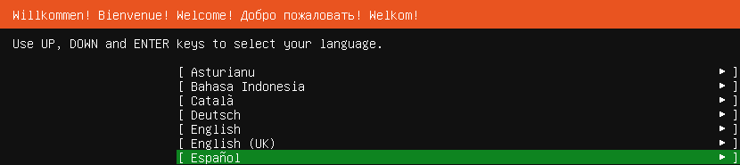
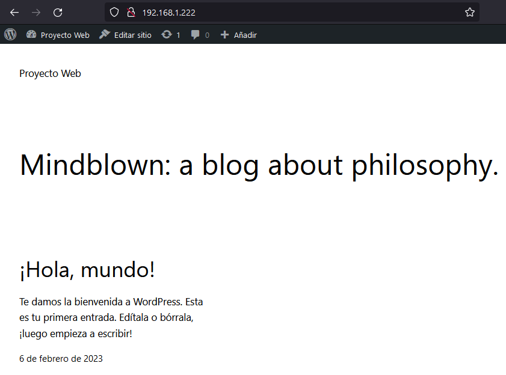
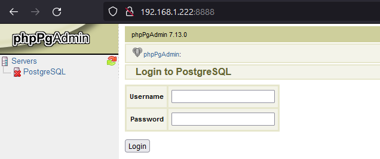
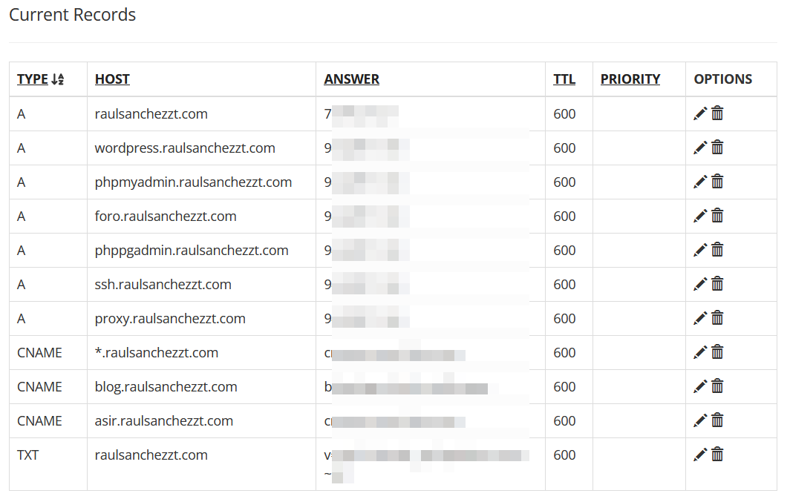
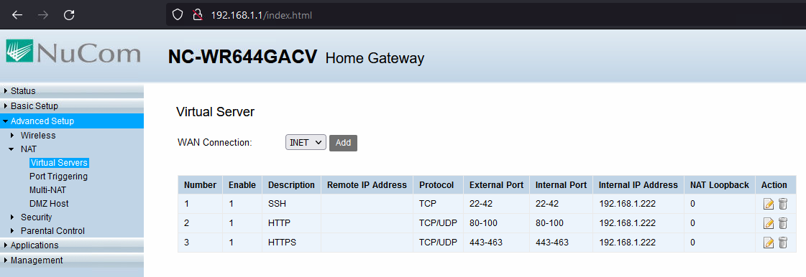

# Proyecto Web Casero

En este proyecto, vamos a utilizar una máquina virtual con [Ubuntu Server](https://ubuntu.com/download/server) dónde instalaremos [Docker](https://www.docker.com/) para crear diferentes contenedores dónde se ejecutarán las aplicaciones web [Wordpress](https://wordpress.org/) y [Odoo](https://www.odoo.com/es_ES).

## Máquina Virtual

Lo primero que tendremos que hacer será crear una máquina virtual con suficientes recursos para nuestro objetivo.


Elegiremos el idioma Español y continuaremos con la instalación...



Instalamos el servicio **SSH** para poder conectarnos después desde otro equipo al servidor de una manera más cómoda.


### Configuración

Esperamos a que se termine de instalar el sistema operativo. Ahora editaremos el archivo de configuración para establecer una dirección **IP** estática a este servidor.

```bash
raul@ubuntu-proyecto-web:~$ sudo nano /etc/netplan/00-installer-config.yaml
```

Escribimos la configuración necesaria...

```yaml
network:
  ethernets:
    ens33:
      addresses:
        - 192.168.1.222/24
      nameservers:
        addresses: [8.8.8.8, 1.1.1.1]
      routes:
        - to: default
          via: 192.168.1.1
  version: 2
```

Después de guardar el archivo, aplicamos la configuración con el siguiente comando.

```bash
raul@ubuntu-proyecto-web:~$ sudo netplan apply
```

Reiniciamos y comprobamos que nos podemos conectar mediante **SSH**.


## Docker

### Instalación

Primero, nos aseguramos que tenemos el sistema actualizado.

```bash
raul@ubuntu-proyecto-web:~$ sudo apt update
Obj:1 http://archive.ubuntu.com/ubuntu jammy InRelease
Des:2 http://archive.ubuntu.com/ubuntu jammy-updates InRelease [114 kB]
Des:3 http://archive.ubuntu.com/ubuntu jammy-backports InRelease [107 kB]
Des:4 http://archive.ubuntu.com/ubuntu jammy-security InRelease [110 kB]
Descargados 331 kB en 7s (44,6 kB/s)
Leyendo lista de paquetes... Hecho
Creando árbol de dependencias... Hecho
Leyendo la información de estado... Hecho
```

Seguiremos la [documentación oficial](https://docs.docker.com/engine/install/ubuntu/) para instalar todos los componentes necesarios...

```bash
raul@ubuntu-proyecto-web:~$ sudo apt-get install \
    ca-certificates \
    curl \
    gnupg \
    lsb-release
Leyendo lista de paquetes... Hecho
Creando árbol de dependencias... Hecho
Leyendo la información de estado... Hecho
gnupg ya está en su versión más reciente (2.2.27-3ubuntu2.1).
fijado gnupg como instalado manualmente.
Los paquetes indicados a continuación se instalaron de forma automática y ya no son necesarios.
  libflashrom1 libftdi1-2
Utilice «sudo apt autoremove» para eliminarlos.
0 actualizados, 0 nuevos se instalarán, 0 para eliminar y 4 no actualizados.lmente.

raul@ubuntu-proyecto-web:~$ sudo mkdir -p /etc/apt/keyrings

raul@ubuntu-proyecto-web:~$ curl -fsSL https://download.docker.com/linux/ubuntu/gpg | sudo gpg --dearmor -o /etc/apt/keyrings/docker.gpg

raul@ubuntu-proyecto-web:~$ echo \
  "deb [arch=$(dpkg --print-architecture) signed-by=/etc/apt/keyrings/docker.gpg] https://download.docker.com/linux/ubuntu \
  $(lsb_release -cs) stable" | sudo tee /etc/apt/sources.list.d/docker.list > /dev/null
```

Ahora actualizamos los repositorios e instalamos...

```bash
raul@ubuntu-proyecto-web:~$ sudo apt-get update
Des:1 https://download.docker.com/linux/ubuntu jammy InRelease [48,9 kB]
Des:2 https://download.docker.com/linux/ubuntu jammy/stable amd64 Packages [12,7 kB]
Descargados 393 kB en 5s (75,9 kB/s)
Leyendo lista de paquetes... Hecho

raul@ubuntu-proyecto-web:~$ sudo apt-get install docker-ce docker-ce-cli containerd.io docker-compose-plugin
Leyendo lista de paquetes... Hecho
Creando árbol de dependencias... Hecho
Leyendo la información de estado... Hecho
```

Comprobamos que está instalado, usando un contenedor de prueba...

```bash
raul@ubuntu-proyecto-web:~$ sudo docker run hello-world
Unable to find image 'hello-world:latest' locally
latest: Pulling from library/hello-world
2db29710123e: Pull complete
Digest: sha256:aa0cc8055b82dc2509bed2e19b275c8f463506616377219d9642221ab53cf9fe
Status: Downloaded newer image for hello-world:latest

Hello from Docker!
This message shows that your installation appears to be working correctly.
```

Si ahora ejecutamos cualquier comando, nos aparecerá este error porque no hemos añadido nuestro usuario al grupo de _docker_ y no tenemos permisos para usar los comandos.

```bash
raul@ubuntu-proyecto-web:~$ docker ps
permission denied while trying to connect to the Docker daemon socket at unix:///var/run/docker.sock: Get "http://%2Fvar%2Frun%2Fdocker.sock/v1.24/containers/json": dial unix /var/run/docker.sock: connect: permission denied
```

Una solución sería usar _docker_ con el usuario **root** o, en este caso vamos a añadir al usuario actual al grupo. Después reiniciaremos y nos sacará de nuestra sesión **SSH**...

```bash
raul@ubuntu-proyecto-web:~$ sudo usermod -a -G docker $USER
raul@ubuntu-proyecto-web:~$ sudo reboot now
Connection to 192.168.1.222 closed by remote host.
Connection to 192.168.1.222 closed.
```

### Crear Contenedores

Ahora, crearemos una nueva carpeta y crearemos el archivo **docker-compose.yml** dónde copiaremos el contenido. Luego lo ejecutaremos y esperamos a que termine...

```bash
raul@ubuntu-proyecto-web:~$ mkdir proyecto-web-casero

raul@ubuntu-proyecto-web:~$ cd proyecto-web-casero/

raul@ubuntu-proyecto-web:~/proyecto-web-casero$ vim docker-compose.yml

raul@ubuntu-proyecto-web:~/proyecto-web-casero$ docker compose up -d
[+] Running 11/11
 ⠿ Network proyecto-web-casero_proyecto-web-casero  Created 0.1s
 ⠿ Volume "proyecto-web-casero_wordpress-db-data"   Created 0.0s
 ⠿ Volume "proyecto-web-casero_odoo-web-data"       Created 0.0s
 ⠿ Volume "proyecto-web-casero_odoo-db-data"        Created 0.0s
 ⠿ Volume "proyecto-web-casero_wordpress-web-data"  Created 0.0s

 ⠿ Container MySQL                                  Started 4.0s
 ⠿ Container PostgreSQL                             Started 4.0s
 ⠿ Container PHPPgAdmin                             Started 8.1s
 ⠿ Container Odoo                                   Started 4.8s
 ⠿ Container Wordpress                              Started 8.0s
 ⠿ Container PHPMyAdmin                             Started 8.0s
```

Ahora podemos ver los contenedores que tenemos corriendo...

```docker
raul@ubuntu-proyecto-web:~/proyecto-web-casero$ docker ps
CONTAINER ID    IMAGE                    PORTS                NAME
34a69e1eedf3    wordpress                8008/tcp             Wordpress
9e3556454c52    phpmyadmin/phpmyadmin    8080/tcp             PHPMyAdmin
997b6b895b32    bitnami/phppgadmin       8888/tcp             PHPPgAdmin
fbe5337790ad    odoo:14.0                88/tcp               Odoo
1d4cc5b14e89    postgres:13              5432/tcp             PostgreSQL
96cfc3eb9807    mysql:5.7                3306/tcp, 33060/tcp  MySQL
```

## Configuración

### Wordpress

Ahora que están corriendo los contenedores, accederemos a la dirección _IP_ de **Wordpress** para comenzar la instalación.


Introducimos la información necesaria para que nuestro sitio web funcione.


No tendremos que indicar ni configurar la base de datos porque ya lo hemos hecho en el archivo de configuración **docker-compose.yml**.


Ahora podremos entrar al panel de administración y empezar al personalizar el sitio web.


Comprobaremos que también funciona el _frontend_.



### PHPMyAdmin

Luego, comprobaremos que podemos acceder a **phpmyadmin** por el puerto **8080**.


Aquí, veremos la base de datos _mywordpress_ con todas sus tablas.


### Odoo

Para configurar _Odoo_ tendremos que acceder mediante el puerto **88**.


Una vez hayamos entrado comenzaremos a personalizar este **CRM** para que funcione solo como foro.


### PHPPgAdmin

Verificamos que podemos acceder a **phppgadmin** por el puerto **8888**.



Observamos todas las tablas que ha creado _Odoo_.


### Enrutamiento

En este caso, tengo un dominio y voy a configurar los registros _DNS_ para que cualquier consulta a los subdominios _wordpress, phpmyadmin, foro, phppgadmin, ssh y proxy_ apunten a la dirección IP pública de mi casa (dónde está funcionando la máquina virtual).



Cuando llegue una petición a la dirección IP de mi casa, el **proxy reverso** redirigirá a cada página web. Cada subdominio tiene como destino un puerto en el servidor local diferente. De esta forma, haremos una conexión cifrada (**HTTPS**) entre el cliente y el servidor web.


En el router, abrimos los puertos **22, 80 y 443** para redirigir al servidor.



## Resultado final

### Wordpress

Después de personalizar las páginas así es como se verían si un usuario accediera mediante internet.


