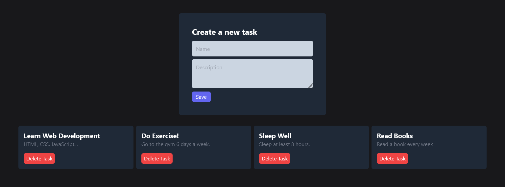

# FAZT - React 2022

In this [course](https://www.youtube.com/watch?v=rLoWMU4L_qE) I have learned a lot about [React](https://reactjs.org/).

## Tasks App

This is the final result of my first application made in [React](https://reactjs.org/).

