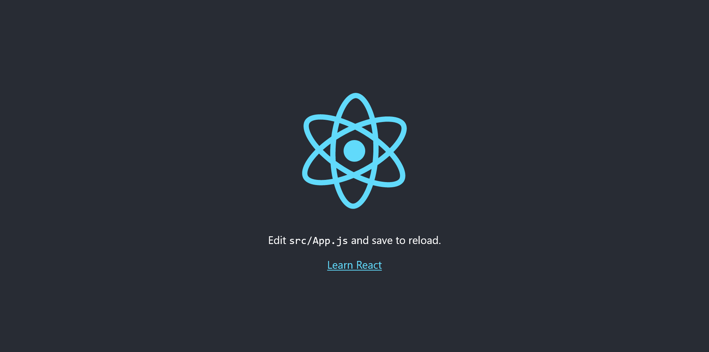
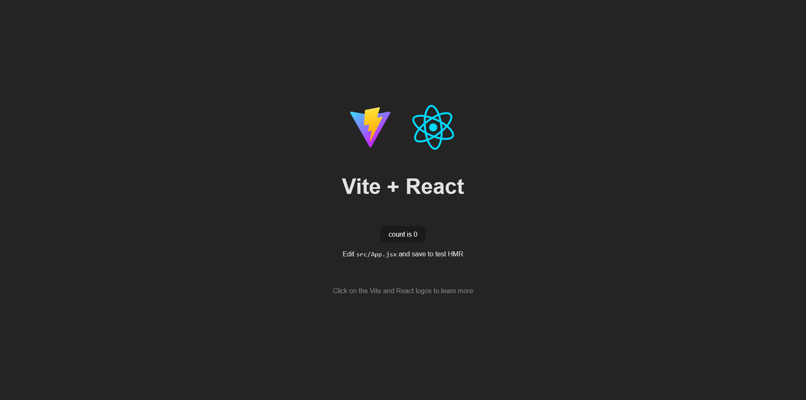

# FAZT - React 2022

In this [course](https://www.youtube.com/watch?v=rLoWMU4L_qE) where I have learned a lot about [React](https://reactjs.org/).

## Create React App

1. Create a new [React](https://reactjs.org/) project using [Create React App](https://create-react-app.dev/).

```bash
$ npx create-react-app react-course

Creating a new React app ...

Installing packages. This might take a couple of minutes.
Installing react, react-dom, and react-scripts with cra-template...

added 1394 packages in 2m

213 packages are looking for funding
  run `npm fund` for details

Initialized a git repository.

Installing template dependencies using npm...

added 72 packages in 13s

226 packages are looking for funding
  run `npm fund` for details
Removing template package using npm...

We suggest that you begin by typing:

  cd react-course
  npm start

Happy hacking!
```

2. Change directory and start the development server.

```bash
$ cd react-course

$ npm start
Compiled successfully!

You can now view react-course in the browser.

  Local:            http://localhost:3000

Note that the development build is not optimized.
To create a production build, use npm run build.

webpack compiled successfully
```

3. Now we can see this in the browser.



### Third Party modules

- Let's install a module like [React Icons](https://react-icons.github.io/react-icons).

```bash
$ npm install react-icons

added 4 packages in 2s
```


## Tasks App

1. First create a new project using [Vite](https://vitejs.dev/).

```bash
$ npm create vite
Need to install the following packages:
  create-vite@3.2.1
Ok to proceed? (y) y
✔ Project name: … react-tasks-application
✔ Select a framework: › React
✔ Select a variant: › JavaScript

Scaffolding project in /home/raul/react-tasks-application...

Done. Now run:

  cd react-tasks-application
  npm install
  npm run dev
```

2. Change directory and install the necessary packages.

```bash
$ cd react-tasks-application/

$ npm install

added 85 packages, and audited 86 packages in 15s

8 packages are looking for funding
  run `npm fund` for details

found 0 vulnerabilities
```

3. Start the development server.

```bash
$ npm run dev

  VITE v3.2.4  ready in 3652 ms

  ➜  Local:   http://localhost:5173/
  ➜  Network: use --host to expose
```

4. Now we can see this in the browser.



### Tailwind CSS

- Let's install [Tailwind](https://tailwindcss.com/docs/guides/vite) CSS!

```js
$ npm install -D tailwindcss postcss autoprefixer

added 56 packages, and audited 142 packages in 8s

20 packages are looking for funding
  run `npm fund` for details

found 0 vulnerabilities
```

- Then, use this command to init the config files.

```js
$ npx tailwindcss init -p

Created Tailwind CSS config file: tailwind.config.cjs
Created PostCSS config file: postcss.config.cjs
```

### Deploy in GiHub Pages

- Now we are going to upload this site to [GitHub Pages](https://pages.github.com/). So we have to install [gh-pages](https://www.npmjs.com/package/gh-pages).

```js
$ npm install gh-pages --save-dev

added 40 packages, and audited 182 packages in 21s

25 packages are looking for funding
  run `npm fund` for details

found 0 vulnerabilities
```

- Then we have to follow this [Vite.js instructions](https://vitejs.dev/guide/static-deploy.html#github-pages).


### Final Result

This is the final result of my first application made in [React](https://reactjs.org/).

