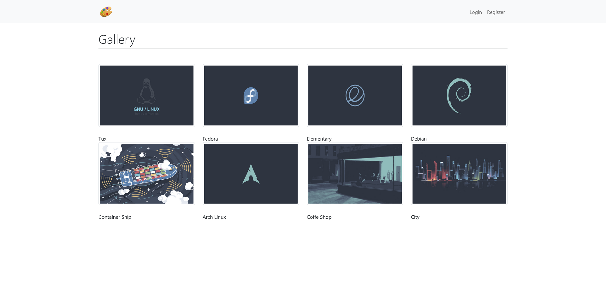
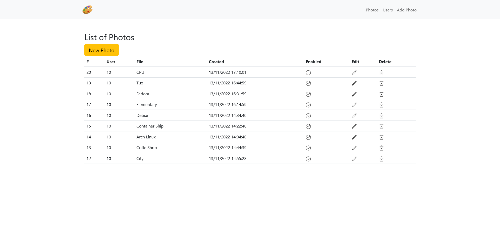
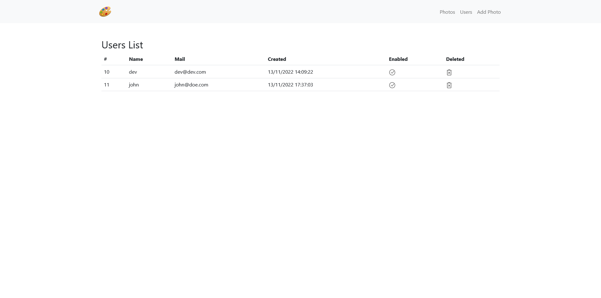
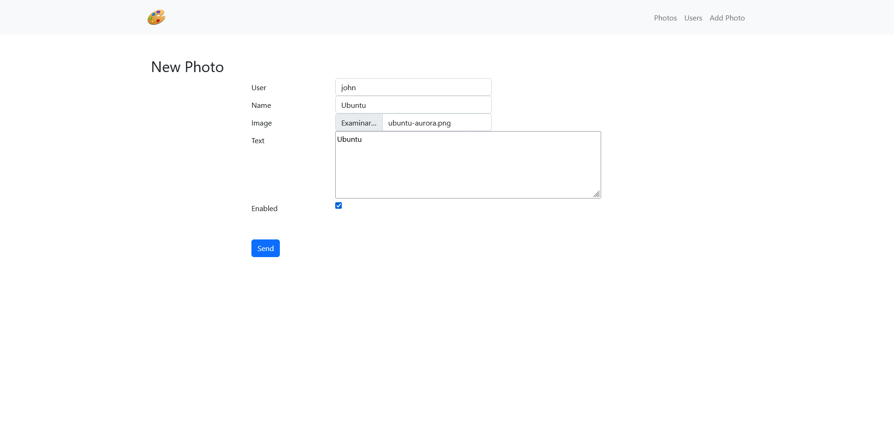

# OpenWebinars - PHP & MYSQL

In this [course](https://openwebinars.net/academia/portada/php-mysql/) I have learned how to create dynamic websites using **PHP** and **Maria-DB**.

## Introduction

### Install PHP, Apache2 & MariaDB in Local

I installed all on **Ubuntu** using [WSL](https://github.com/RaulSanchezzt/dotfiles/tree/wsl).

```bash
$ sudo apt install php apache2 mariadb-server php-mysql phpmyadmin
```

Configure **MariaDB**.

```bash
$  sudo mysql_secure_installation

NOTE: RUNNING ALL PARTS OF THIS SCRIPT IS RECOMMENDED FOR ALL MariaDB
      SERVERS IN PRODUCTION USE!  PLEASE READ EACH STEP CAREFULLY!

In order to log into MariaDB to secure it, we'll need the current
password for the root user. If you've just installed MariaDB, and
haven't set the root password yet, you should just press enter here.

Enter current password for root (enter for none):
```

Create a new user in **MariaDB** and grant **all privileges**.

```bash
❯ sudo mysql
Welcome to the MariaDB monitor.  Commands end with ; or \g.
Your MariaDB connection id is 532
Server version: 10.6.7-MariaDB-2ubuntu1.1 Ubuntu 22.04

Copyright (c) 2000, 2018, Oracle, MariaDB Corporation Ab and others.

Type 'help;' or '\h' for help. Type '\c' to clear the current input statement.

MariaDB [(none)]> create user 'devuser'@'%' identified by 'test1234';

MariaDB [(none)]> grant all privileges on *.* to 'devuser'@'%' identified by 'test1234';
Query OK, 0 rows affected (0.003 sec)

MariaDB [(none)]> select user, host, password from mysql.user;
+-------------+-----------+-------------------------------------------+
| User        | Host      | Password                                  |
+-------------+-----------+-------------------------------------------+
| devuser     | %         | *3D3B92F242033365AE5BC6A8E6FC3E1679F4140A |
| phpmyadmin  | localhost | *6261203B1FE4E2741D55025F46349211FF83DCB3 |
+-------------+-----------+-------------------------------------------+
```

Then **start** the **services**.

```bash
$ sudo service apache2 start
    * Starting Apache httpd web server apache2

$ sudo service mariadb start
    * Starting MariaDB database server mariadbd                                [ OK ]
```

Finally, start a **PHP** server using this [extension](https://marketplace.visualstudio.com/items?itemName=brapifra.phpserver) in **VSCode** and import the **databases** using the **SQL** scripts in ``phpmyadmin``.

## Using Docker

First, create and start containers of this project.

```docker
$ docker compose up -d
[+] Running 5/5
 ⠿ Network openwebinars-phpmysql_default      Created                                                              0.0s
 ⠿ Volume "openwebinars-phpmysql_persistent"  Created                                                              0.0s
 ⠿ Container MySQL                            Started                                                              0.8s
 ⠿ Container WWW                              Started                                                              1.5s
 ⠿ Container PHPMyAdmin                       Started                                                              1.6s
```

Then go to `phpmyadmin` searching in the browser `http://localhost:8000/` and run the scripts to create the tables in the **gallery database**.

Finally, go to the web page located in `http://localhost/gallery/`.


## Gallery

### Final Result

- Main page



- Create a new user


- Sing in


- Main Admin Page



- List Users



- Add a new photo



---

## Technologies used

- [PHP](https://www.php.net/)
- [Apache2](https://apache.org/)
- [MariaDB](https://mariadb.org/)
- [Bootstrap](https://getbootstrap.com/)
    - [Snippets](https://startbootstrap.com/snippets)
- [Icons8](https://icons8.com/icons/ios)