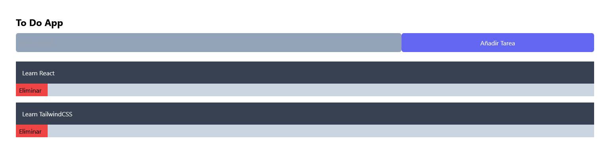

# OpenWebinars - To Do App React

In this [course](https://openwebinars.net/academia/portada/organizate-reactjs/) I have learned about `useState`, `useEffect` [React](https://reactjs.org/) **Hooks** creating a small To Do App. 

## Create App

- First, we use [Create React App](https://create-react-app.dev/).

```js
$ npx create-react-app todo-app
```

- Change directory and start local server.

```js
$  cd todo-app/

$ npm run start

Compiled successfully!

You can now view todo-app in the browser.

  Local:            http://localhost:3000

Note that the development build is not optimized.
To create a production build, use npm run build.

webpack compiled successfully
```

## TailwindCSS

- Now install [TailwindCSS](https://tailwindcss.com/docs/guides/create-react-app).

```js
$ npm install -D tailwindcss postcss autoprefixer

up to date, audited 1466 packages in 7s

226 packages are looking for funding
  run `npm fund` for details
```

- Generate `config` files.

```js
$ npx tailwindcss init -p

Created Tailwind CSS config file: tailwind.config.js
Created PostCSS config file: postcss.config.js
```

## Final Result

This is the final result of this small project.

