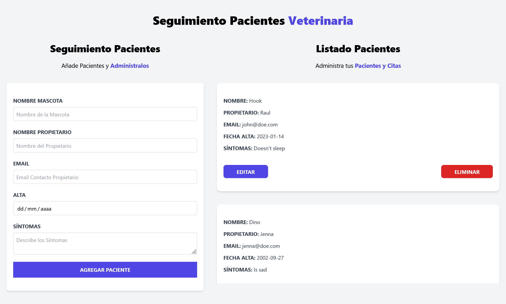

# Udemy - React Bootcamp

In this [course](https://www.udemy.com/course/react-de-principiante-a-experto-creando-mas-de-10-aplicaciones/) I have learned about how to create web interfaces using [React](https://reactjs.org/), and other tools like [Vite](https://vitejs.dev/), [Tailwind CSS](https://tailwindcss.com/)...

## [JS Introduction](./JS%20Introduction/)

A short review of the [JavaScript](https://www.javascript.com/) language before starting to do practical examples with **React**.

## [Patient Administrator](./patient-administrator/)

A small project where I have learned about [React](https://reactjs.org/) Hooks and more. This is the [link to the page](https://patient-administrator.netlify.app/).

## [Expense Control](./expense-control/)

