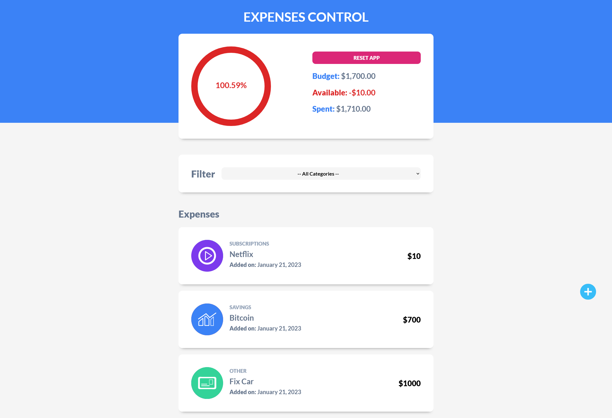
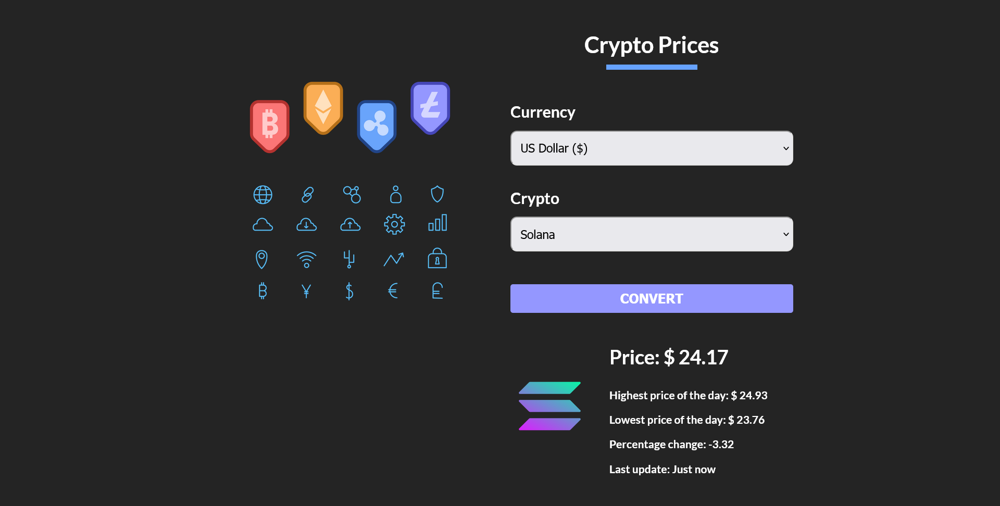
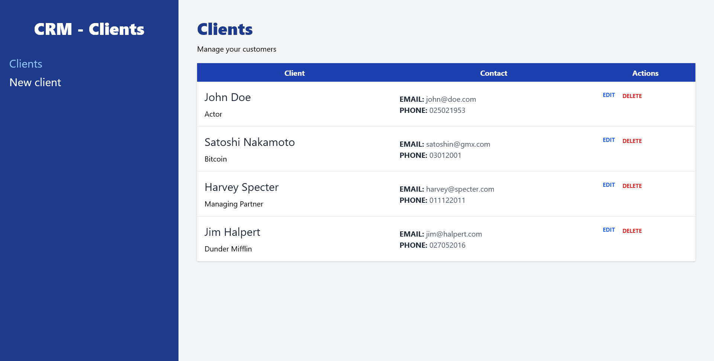

# Udemy - React Bootcamp

In this [course](https://www.udemy.com/course/react-de-principiante-a-experto-creando-mas-de-10-aplicaciones/) I have learned about how to create web interfaces using [React](https://reactjs.org/), and other tools like [Vite](https://vitejs.dev/), [Tailwind CSS](https://tailwindcss.com/)...

## [JS Introduction](./JS%20Introduction/)

A short review of the [JavaScript](https://www.javascript.com/) language before starting to do practical examples with **React**.

## [Patient Administrator](./patient-administrator/)

A small project where I have learned about [React](https://reactjs.org/) Hooks and more. [Link to the demo page](https://patient-administrator.netlify.app/).

## [Expense Control](./expense-control/)

A great project where I have learned more about [React](https://reactjs.org/) Hooks, _LocalStorage_ and other dependencies. [Link to the demo page](https://expenses-control-project.netlify.app/).

## [Crypto Prices](./crypto-prices/)

A project where I use **React Custom Hooks**, _fetch API_, **Styled Components**... to see the price of Crypto in various currencies. [Link to the demo page](https://crypto-prices-converter.netlify.app/).

## [Customer Relationship Management](./crm-react/)

A project where I use [React Router DOM](https://reactrouter.com/en/main), [Tailwind CSS](https://tailwindcss.com/), and [JSON Server](https://www.npmjs.com/package/json-server) to create a **CRM** with different pages. [Link to the demo page](https://customer-relationship-management.netlify.app/)

