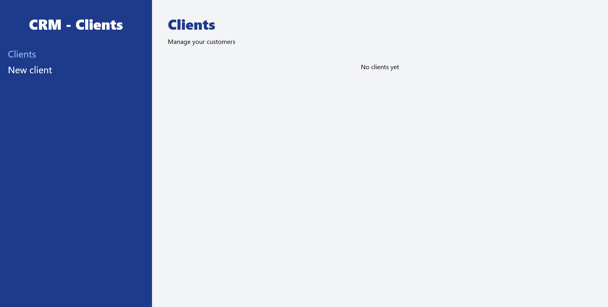
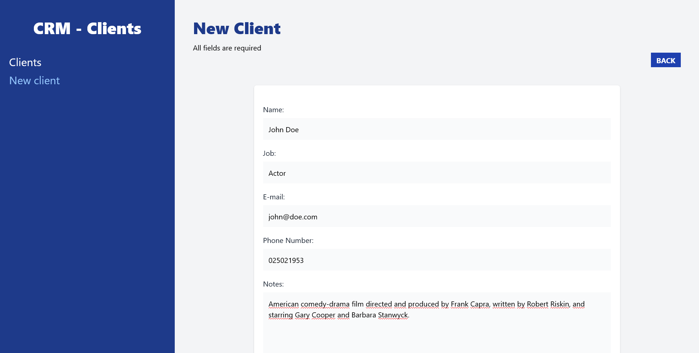
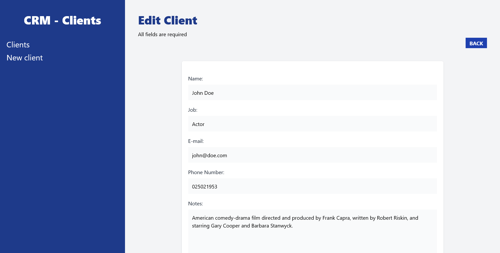

# Customer Relationship Management

In this project I have learned about [React Router DOM](https://reactrouter.com/en/main) and [JSON Server](https://www.npmjs.com/package/json-server).

## Creating the project

Create a new project using [Vite](https://vitejs.dev/)...

```js
$ npm create vite@latest
✔ Project name: … crm-react
✔ Select a framework: › React
✔ Select a variant: › JavaScript

Done. Now run:

  cd crm-react
  npm install
  npm run dev

$ cd crm-react/

$ npm install

added 82 packages, and audited 83 packages in 24s

8 packages are looking for funding
  run `npm fund` for details

found 0 vulnerabilities

$ npm run dev

> crm-react@0.0.0 dev
> vite


  VITE v4.0.4  ready in 15950 ms

  ➜  Local:   http://localhost:5173/
  ➜  Network: use --host to expose
  ➜  press h to show help
```

## Dependencies

Then, install the necessary dependencies to use [Tailwind CSS](https://tailwindcss.com/).

```js
$ npm install -D tailwindcss postcss autoprefixer

added 56 packages, and audited 139 packages in 22s

20 packages are looking for funding
  run `npm fund` for details

found 0 vulnerabilities

$ npx tailwindcss init -p

Created Tailwind CSS config file: tailwind.config.cjs
Created PostCSS config file: postcss.config.cjs
```

## Router

Install [react-router-dom](https://www.npmjs.com/package/react-router-dom.)

```js
$ npm install react-router-dom

added 8 packages, and audited 9 packages in 25s

found 0 vulnerabilities
```

## Creating a REST API

Install [JSON Server](https://www.npmjs.com/package/json-server).

```js
$ npm install -g json-server

added 109 packages, and audited 110 packages in 10s

10 packages are looking for funding
  run `npm fund` for details

found 0 vulnerabilities
```

Starting JSON Server...

```js
$ json-server --watch db.json

  \{^_^}/ hi!

  Loading db.json
  Done

  Resources
  http://localhost:3000/clients

  Home
  http://localhost:3000

  Type s + enter at any time to create a snapshot of the database
  Watching...

GET /clients 200 3.921 ms - 586
```

## Final result

First, make sure you **JSON Server** is running. We'll see there are no clients yet...



So let's add a new client...



Now we will see our clients.


Finally, we can edit the client or delete it.

