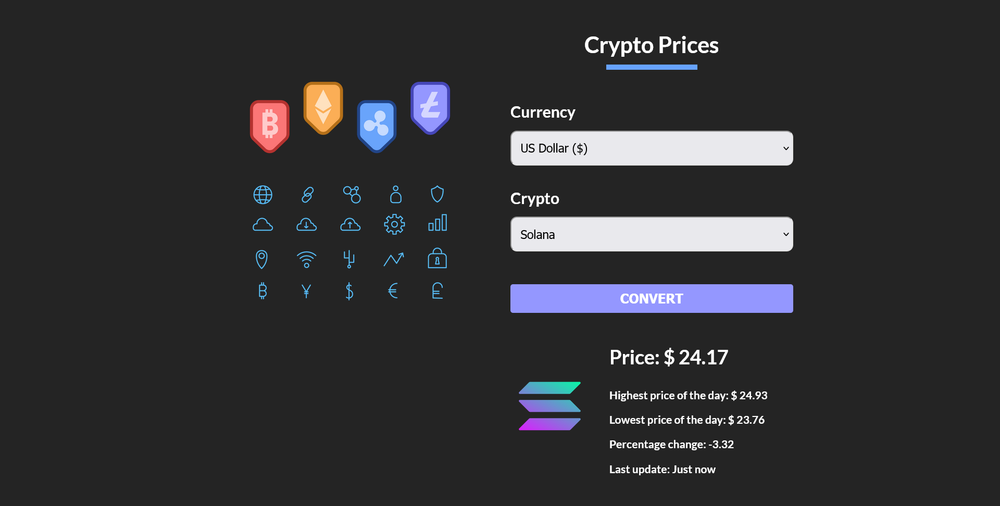

# Crypto Prices

In this project I have learned about [Styled Components](https://styled-components.com/), **React Custom Hooks** and how to query an external **API** and how to treat that data in my application. We will use [Google Fonts](https://fonts.google.com/), [CryptoCompare APIs](https://min-api.cryptocompare.com/documentation) and [Spinkit](https://tobiasahlin.com/spinkit/).

## Creating the project

Create a new project using [Vite](https://vitejs.dev/)...

```js
$ npm init vite@latest
✔ Project name: … crypto-prices
✔ Select a framework: › React
✔ Select a variant: › JavaScript

Done. Now run:

  cd crypto-prices
  npm install
  npm run dev


$ cd crypto-prices/

$ npm install

added 82 packages, and audited 83 packages in 22s

8 packages are looking for funding
  run `npm fund` for details

found 0 vulnerabilities
```

## Dependencies

Install the necessary dependencies...

```js
$ npm install @emotion/react @emotion/styled

added 36 packages, and audited 119 packages in 23s

11 packages are looking for funding
  run `npm fund` for details

found 0 vulnerabilities
```

## Final result

First, you have to select a currency and a crypto. [Link to the demo page](https://crypto-prices-converter.netlify.app/).


All fields are required to continue...


In this case we are comparing Solana to USD.



---

[](https://app.netlify.com/sites/crypto-prices-converter/deploys)