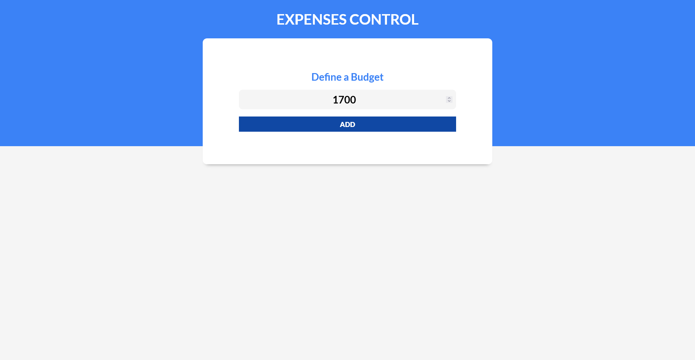
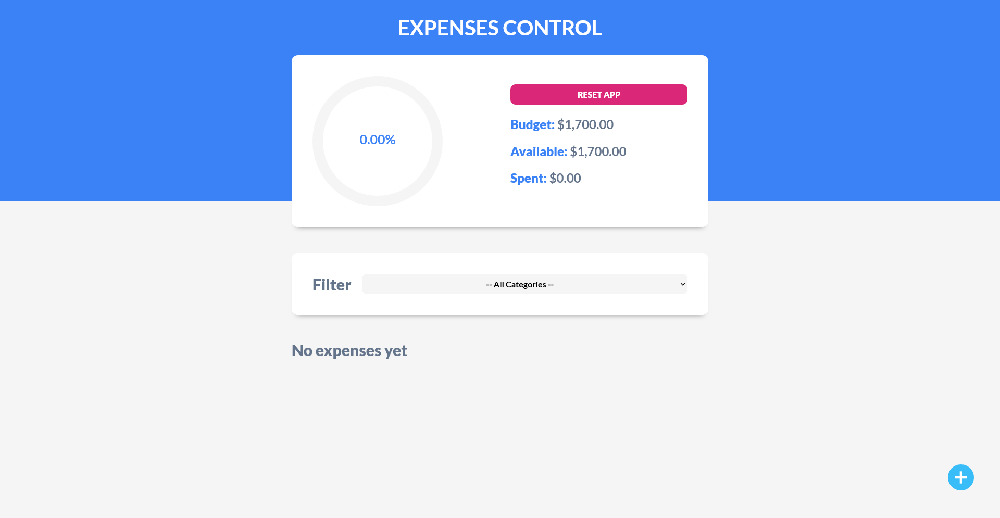
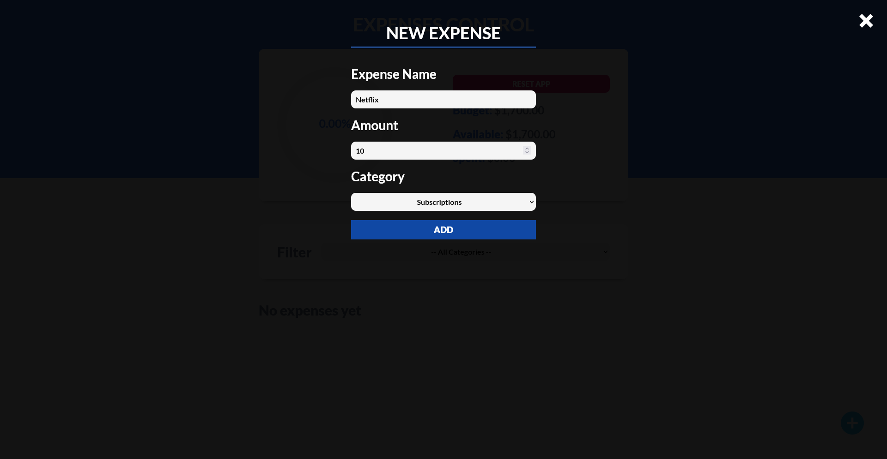
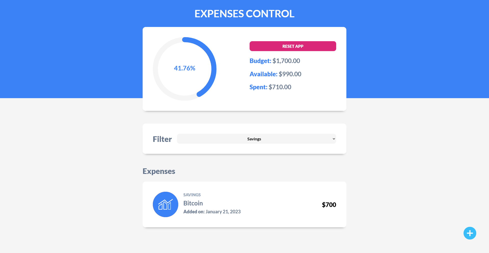
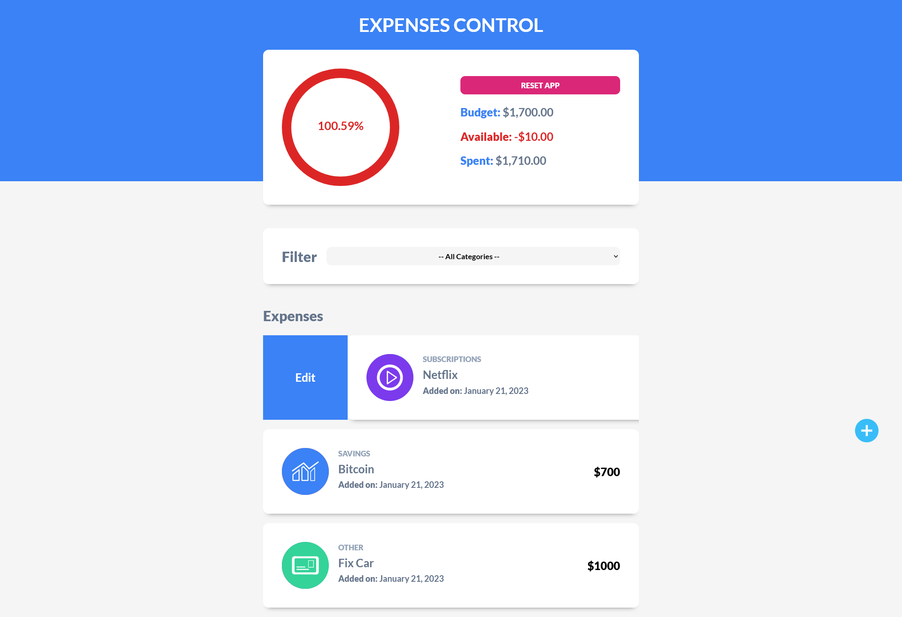
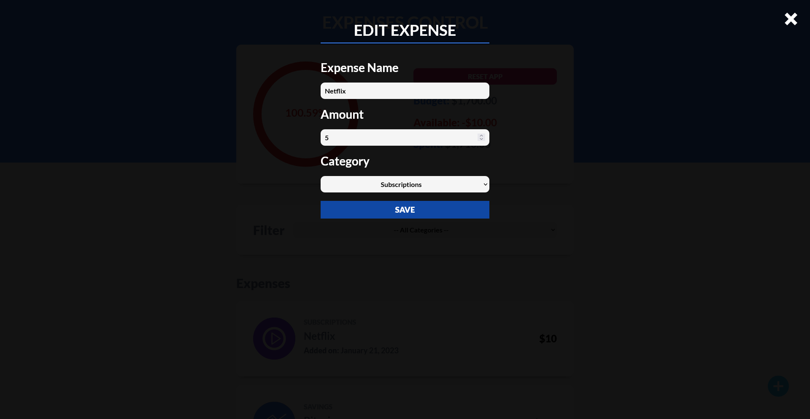
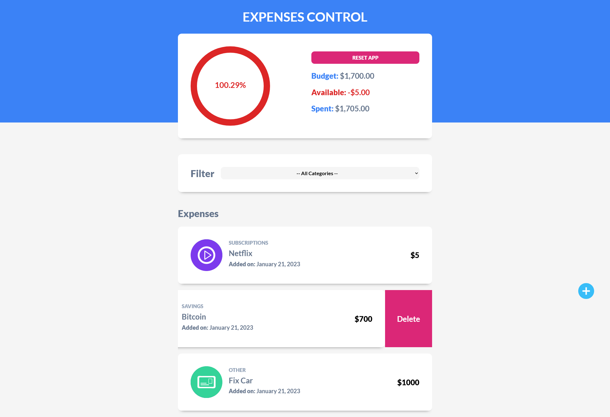
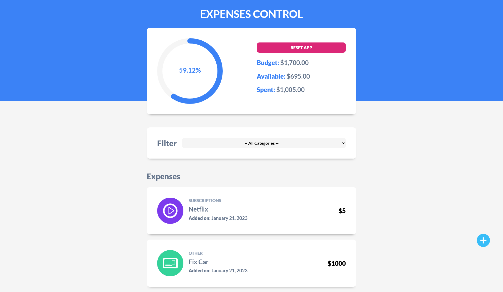

# Expenses Control

In this case we are using [React](https://reactjs.org/), [Normalize.css](https://necolas.github.io/normalize.css/), [Google Fonts](https://fonts.google.com/) and other dependencies.

## Creating the project

First, we have to initialize the project using [Vite](https://vitejs.dev/), then we will select the name and the framework we want to use. In this case will be [React](https://reactjs.org/) (JavaScript).

```js
// Create a new project
$ npm init vite@latest
✔ Project name: … expense-control
✔ Select a framework: › React
✔ Select a variant: › JavaScript

Scaffolding project in /mnt/c/Users/Raul/Code/projects/WebDev/Udemy - React Bootcamp/expense-control...

Done. Now run:

  cd expense-control
  npm install
  npm run dev

// Change the directory
$ cd expense-control/

// Install dependencies
$ npm i

added 82 packages, and audited 83 packages in 26s

8 packages are looking for funding
  run `npm fund` for details

found 0 vulnerabilities

// Run the development server
$ npm run dev

VITE v4.0.4  ready in 10625 ms

  ➜  Local:   http://localhost:5173/
  ➜  Network: use --host to expose
  ➜  press h to show help
```

## Installing Dependencies

Then, we are going to install some dependencies using [npm](https://www.npmjs.com/).

```js
$ npm i react-swipeable-list

added 1 package, and audited 84 packages in 2s

8 packages are looking for funding
  run `npm fund` for details

found 0 vulnerabilities

$ npm i prop-types

added 3 packages, and audited 87 packages in 3s

8 packages are looking for funding
  run `npm fund` for details

found 0 vulnerabilities

$ npm i react-circular-progressbar

added 1 package, and audited 88 packages in 2s

8 packages are looking for funding
  run `npm fund` for details

found 0 vulnerabilities
```

## Final result

First, define a budget. [Link to the demo page](https://expenses-control-project.netlify.app/).



Then add a new expense.



Now add expenses like _Netflix_...



Filter by the category you want like _Savings_.



if we spend more than we can afford, we will see that it changes color.


By moving the expense to the right we can edit it.



Change the price of the subscription.



We see that the price has changed and by moving to the left we delete another expense.



At the end we see that the expense has been deleted.



---

[](https://app.netlify.com/sites/expenses-control-project/deploys)