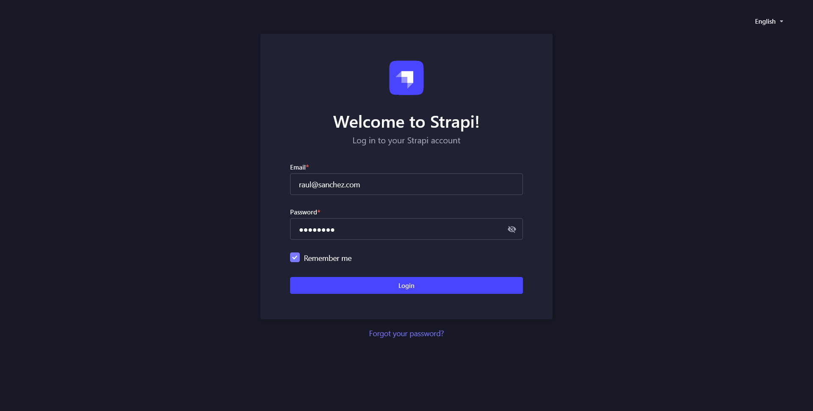
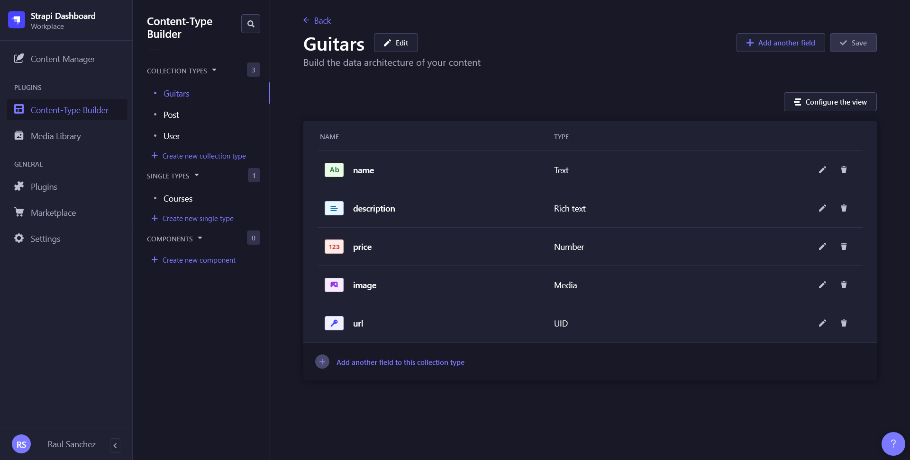
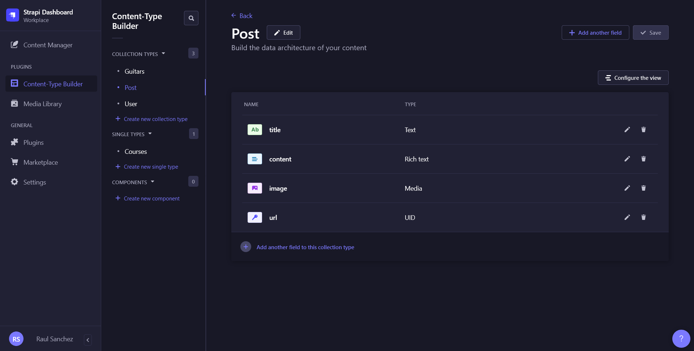
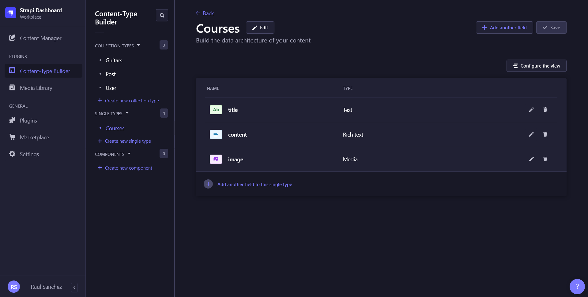

# GuitarLA Strapi

In this project I have learned about how to create a **REST API** using [strapi](https://strapi.io/) to make the backend for other projects. Other technologies that have been used is this project are [render](https://render.com) to host the [PostgreSQL](https://www.postgresql.org/) **database** and [Cloudinary](https://cloudinary.com/) to save the images.

## Installing Strapi

First, create a new project of **Strapi** using the necessary credentials of **render**.

```js
$ npx create-strapi-app@latest
Need to install the following packages:
  create-strapi-app@4.6.0
Ok to proceed? (y) y
? What would you like to name your project? guitarla-strapi
? Choose your installation type Custom (manual settings)
? Choose your preferred language JavaScript
? Choose your default database client postgres
? Database name: guitarla_8pjb
? Host: dpg-cffp4p82i3mg6p9gdnog-a.frankfurt-postgres.render.com
? Port: 5432
? Username: root
? Password: ********************************
? Enable SSL connection: Yes

Creating a project with custom database options.
Creating a new Strapi application at /home/raul/projects/WebDev/Udemy - React Bootcamp/guitarla-strapi.
Creating files.
Dependencies installed successfully.

Your application was created at /home/raul/projects/WebDev/Udemy - React Bootcamp/guitarla-strapi.

Available commands in your project:

  npm run develop
  Start Strapi in watch mode. (Changes in Strapi project files will trigger a server restart)

  npm run start
  Start Strapi without watch mode.

  npm run build
  Build Strapi admin panel.

  npm run strapi
  Display all available commands.

You can start by doing:

  cd /home/raul/projects/WebDev/Udemy - React Bootcamp/guitarla-strapi
  npm run develop

```

Then run this commands to start the admin UI.

```js
$ cd guitarla-strapi/

$ npm run develop

> guitarla-strapi@0.1.0 develop
> strapi develop

Building your admin UI with development configuration...
Admin UI built successfully
[2023-02-05 12:43:43.856] info: The Users & Permissions plugin automatically generated a jwt secret and stored it in .env under the name JWT_SECRET.

 Project information

┌────────────────────┬──────────────────────────────────────────────────┐
│ Time               │ Sun Feb 05 2023 12:44:22 GMT+0100 (Central Euro… │
│ Launched in        │ 78938 ms                                         │
│ Environment        │ development                                      │
│ Process PID        │ 1359                                             │
│ Version            │ 4.6.0 (node v18.12.1)                            │
│ Edition            │ Community                                        │
│ Database           │ postgres                                         │
└────────────────────┴──────────────────────────────────────────────────┘

 Actions available

One more thing...
Create your first administrator 💻 by going to the administration panel at:

┌─────────────────────────────┐
│ http://localhost:1337/admin │
└─────────────────────────────┘
```

Finally, create the necessary **Content-Type** for the project and open the **endpoints** _(Public: find, findOne)_.

## Cloudinary

Let's install the [cloudinary](https://www.npmjs.com/package/@strapi/provider-upload-cloudinary) dependence.

```js
$ npm install @strapi/provider-upload-cloudinary --save

added 53 packages, and audited 1561 packages in 11s

135 packages are looking for funding
  run `npm fund` for details

found 0 vulnerabilities
```

Then, add the necessary credentials to the `.env` file to connect to your account.

## Final result

This is the final result of the configuration. First, log in with the user you've created before.



**Content-Type** created:







The, add some content.