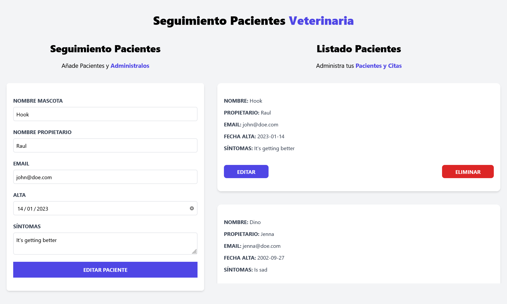

# Patient Administrator

In this project I have learned how to use [useState](https://reactjs.org/docs/hooks-state.html) and [useEffect](https://reactjs.org/docs/hooks-effect.html) Hooks in [React](https://reactjs.org/). Also in this project I have used [Tailwind CSS](https://tailwindcss.com/) for the styles and **localStorage** to store the patients in a persistent way in local.


## Creating our first project

First, we have to create a new project using [npm](https://www.npmjs.com/). We will select the name and the framework we want to use. In this case will be [React](https://reactjs.org/) *(JavaScript)*.
```js
$ npm init vite@latest
Need to install the following packages:
  create-vite@4.0.0
Ok to proceed? (y) y
✔ Project name: … patient-administrator
✔ Select a framework: › React
✔ Select a variant: › JavaScript

Done. Now run:

  cd patient-administrator
  npm install
  npm run dev
```

## Tailwind CSS

Install it using the [official documentation](https://tailwindcss.com/docs/guides/vite).

```js
$ npm install -D tailwindcss postcss autoprefixer

added 56 packages, and audited 139 packages in 14s

20 packages are looking for funding
  run `npm fund` for details

found 0 vulnerabilities

$ npx tailwindcss init -p

Created Tailwind CSS config file: tailwind.config.cjs
Created PostCSS config file: postcss.config.cjs
```

## Final result

This is the final result of this project. This is the [link to the page](https://patient-administrator.netlify.app/).




---

<center>

[](https://app.netlify.com/sites/patient-administrator/deploys)

</center>
